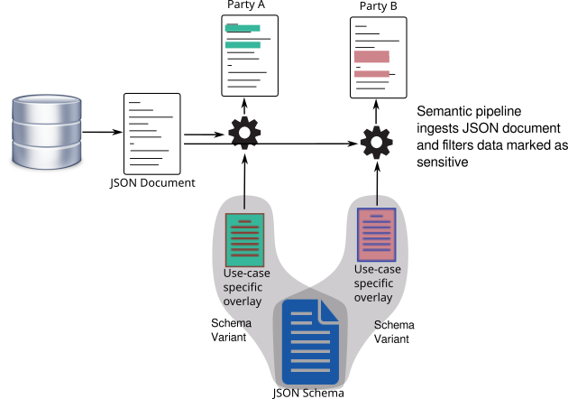

# Selective Disclosure using the Layered Schema Architecture

Selective disclosure allows a party to share a limited set of
information with other parties. In personal data exchange scenarios,
selective disclosure allows an individual to share only the necessary
information with others. Layered schema architecture enables selective
disclosure by annotating schemas with privacy tags. These privacy tags
classify data elements with different privacy levels that the data
owner can enable or disable based on the data exchange context.

The following figure illustrates selective disclosure of a JSON
document to different parties. For each different party or use case,
an overlay is defined (or auto-generated) that marks certain fields as
"sensitive". This overlay is combined with a schema to form a "schema
variant", which is a schema tuned for a specific use case. When the
JSON document is ingested using this schema variant, resulting data
contains the "sensitive" tags for the selected fields. The pipeline
removes all fields marked as "sensitive", and returns a JSON document
to the recipient party. This real-time filtering allows decoupling the
use-case specific selective disclosure logic from the backend
(datbase, or wallet.)




To illustrate this concept, let's consider a sample user profile data
structure containing some demographic information, represented as a
JSON schema [profile.schema.json](profile.schema.json). This schema
contains person's name, address, and phone information. 

The following is a sample JSON document (given in
[profile.json](profile.json)):

```
{
    "firstName": "john",
    "lastName": "doe",
    "address": {
        "street": "123 Main St.",
        "city": "Anycity",
        "state": "CO",
        "postalCode": "80000",
        "country": "US"
    },
    "phone": [
        {
            "type": "cell",
            "number": "123-123 1234"
        }
    ]
}
```

For this example, we will mark phone number, street address, and last
name as "sensitive" using the following overlay:

```
{
    "definitions": {
        "Profile": {
            "properties": {
                "lastName": {
                    "x-ls": {
                        "privacyLevel": "sensitive"
                    }
                }
            }
        },
        "Address": {
            "properties": {
                "street": {
                    "type": "string",
                    "x-ls": {
                        "privacyLevel": "sensitive"
                    }
                }
            }
        },
        "Phone": {
            "properties": {
                "number": {
                    "x-ls": {
                        "privacyLevel": "sensitive"
                    }
                }
            }
        }
    }
}
```

Note that the overlay matches the JSON schema structure. It adds
`x-ls/privacyLevel` property to the sensitive fields (`x-ls` is
recognized by the LSA tooling.)

Next step is to combine the schema with this overlay to create a
schema variant. This is done with a schema bundle as below:

```
jsonSchemas:
  - name: profile.schema.json
    id: http://example.org/ProfileSchema
    overlays:
      - profile-sensitive.ovl.json
variants:
  http://example.org/Profile:
    jsonSchema:
      ref: http://example.org/ProfileSchema#/definitions/Profile
      layerId: http://example.org/Profile
```

This schema bundle reads the JSON schema `profile.schema.json`,
combines it with the overlay `profile-sensitive.ovl.json`, then
defines a data type `http://example.org/Profile` by pointing to the
location in the schema variant where `Profile` object is defined. 

To process data using this schema, we need a pipeline. The below
pipeline first ingests JSON data using the `profile-sensitive`
bundle. The output of this operation is a [labeled property
graph](ingested-graph.svg) containing the `privacyLevel` annotations
given in `profile-sensitive.ovl.json`. This is **self-describing
data**, data that contains the schema information together with data
elements. The `oc` operation runs openCypher expressions on this
graph, removing all nodes that are marked with `privacyLevel:
sensitive`. The final step translates the graph to JSON.

```
- operation: ingest/json
  params:
    bundle:
      - profile-sensitive.bundle.yaml
    type: http://example.org/Profile

- operation: oc
  params:
    expr:
      - match (k {`privacyLevel`:"sensitive"}) detach delete k
    
- operation: export/json
```

This pipeline can be run using:

```
layers pipeline --file sensitive.pipeline.yaml profile.json 
```

(The `layers` program can be downloaded from https://github.com/cloudprivacylabs/lsa/releases)

The output is:

```
{
  "firstName": "john",
  "address": {
    "city": "Anycity",
    "state": "CO",
    "postalCode": "80000",
    "country": "US"
  },
  "phone": [
    {
      "type": "cell"
    }
  ]
}
```

As you can see, the output does not contain those fields that are
markes as sensitive.
